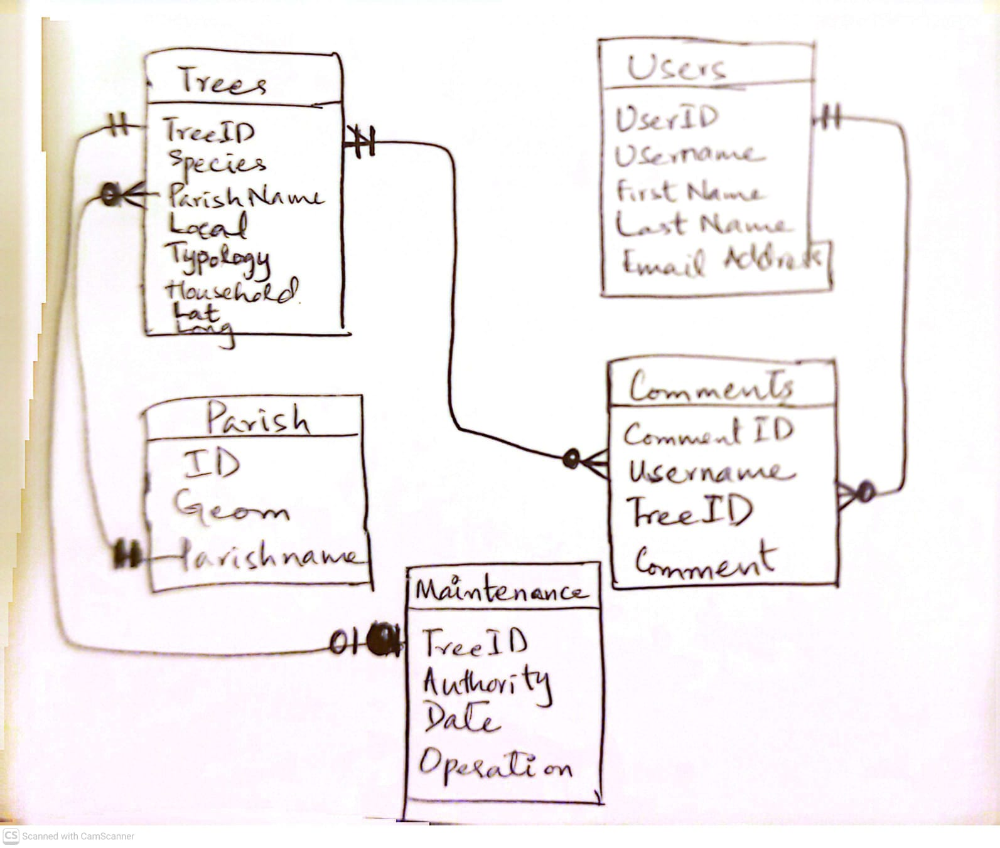
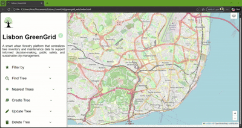
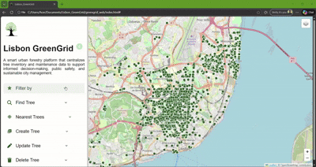
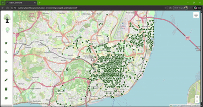
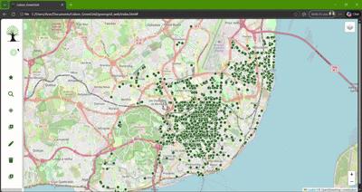
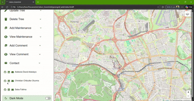
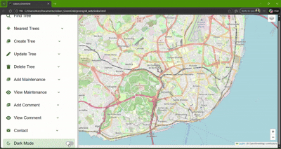
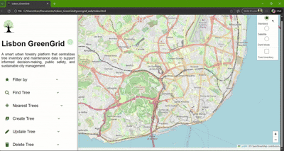

<p align="center">
  <br><br>
</p>

<h1 align="center">
  <span style="color:#2d5a27;">Lisbon GreenGrid</span>
</h1>

<p align="center">
  <span style="color:#f4b400;">
    Urban Tree Inventory & Maintenance Management System
  </span>
</p>

<p align="center">
  
  
  
  
</p>


## 1. Introduction

Urban trees play a crucial role in improving air quality, mitigating urban heat, and enhancing the quality of life in cities. Municipal governments and urban planners often need to maintain detailed inventories of trees to monitor their condition and plan maintenance activities.

Lisbon_GreenGrid is an urban tree inventory & maintenance management system. This project aims to develop a simple yet robust system for managing urban trees in Lisbon city. The system stores spatial information about trees, their species, size, location, other relevant info, and the authority responsible for maintenance status. It enables city planners or maintenance teams to efficiently query, insert, update, and manage tree-related data through a web application.

---

## 2. Project Objectives

The main objectives of this project include:

* To centralize and manage urban tree inventory data in a structured spatial database.
* To support data-driven maintenance planning and risk assessment.
* To enable sustainable urban forestry decision-making.
* To provide an interactive map interface for visualization and analysis.
* To support full Create, Read, Update, and Delete (CRUD) operations

---

## 3. System Architecture

The system follows a clear and modular architecture:


Each component is independent and can be executed or tested separately. Input data in GeoJSON format is extracted, normalized, validated, and loaded into the target database.

---

## 4. Dataset

The project employed **open-access urban tree datasets**, typically provided by:

* Lisbon open data portal (Portal Dados Abertos): https://dados.cm-lisboa.pt/dataset/arvoredo

The dataset include geographic coordinates, species information, and basic tree attributes. **Lisbon Parishes shapefile** obtained from [CAOP 2024](https://www.dgterritorio.gov.pt/atividades/cartografia/cartografia-tematica/caop) was also used in this project. All datasets used are open source and free to use.

---

## 5. Database Design

The database was implemented in **PostgreSQL with the PostGIS extension** and follows a relational model.
More details about the database architecture and its execution procedure can be found in the [Database README](https://github.com/Lisbon-GreenGrid/Lisbon-GreenGrid/blob/main/greengrid_db/README.md)

### 5.1 Main Tables

| Table Name           | Description                                  | Spatial Data |
| -------------------- | -------------------------------------------- | ------------ |
| `trees`              | Individual urban trees and their locations   | POINT        |
| `operations`            | Reference table for specific maintenance operations | No           |
| `maintenance`      | Maintenance records for the trees | No           |
| `parish` | Administrative districts of Lisbon city        | POLYGON           |
| `users`          | Details of users who make comments         | No      |
| `comments`          | Reference table for comments made on different trees         | No      |


### 5.2 Core Table: `trees`

Key attributes:

* `tree_id` (Primary Key) - Unique Tree ID from the Lisbon City Council
* `nome_vulga` - Tree common name
* `especie` - Scientific name
* `tipologia` - Tree type
* `pap` - Perimeter at breast height
* `manutencao` - Authority in charge of a tree's maintenance
* `ocupacao` - Occupation
* `local` - Location
* `morada` - Address
* `freguesia` - Parish name
* `geometry` (POINT geometry, SRID 4326)




---

## 6. ETL Module

### 6.1 Overview

The ETL pipeline follows a modular architecture:

1. Configuration Layer
2. Extraction Layer
3. Transformation Layer
4. Loading Layer
5. Logging Layer


### 6.2 ETL Workflow

1. Extracting raw data in GeoJSON format
2. Cleaning and transforming the dataset
3. Loading structured data into a POSTGIS database
4. Logging pipeline execution


### 6.3 Execution

The ETL runs independently using a single command:

```cmd

python main.py

```

Detailed information on the ETL structure, workflow and implementation can be found in the [ETL README](https://github.com/Lisbon-GreenGrid/Lisbon-GreenGrid/blob/main/greengrid_etl/README.md)

---

## 7. CRUD Operations

The project supports full CRUD functionality:

* **Create** new tree records
* **Read** existing tree information
* **Update** tree attributes and maintenance records
* **Delete** obsolete or removed trees

CRUD operations is exposed through the API and executed against the relational database.

---

## 8. API Module

### 8.1 Available Endpoints

| Method | Endpoint                        | Description                           |
| ------ | ------------------------------- | ------------------------------------- |
| GET    | `/trees`                        | Retrieve all trees                    |
| GET    | `/trees/{id}`                   | Retrieve a tree by ID                 |
| GET    | `/tree/{id}/comments`           | Get comment history (with limit)      |
| GET    | `/tree/{id}/maintenance`        | Get maintenance history (with limit)  |
| POST   | `/trees`                        | Insert a new tree                     |
| POST   | `/tree/{id}/comment             | Add a new comment                     |
| POST   | `/tree/{id}/maintenance`        | Add a new maintenance status          |
| PUT    | `/trees/{id}`                   | Update a tree                         |
| DELETE | `/trees/{id}`                   | Delete a tree                         |
| GET    | `/trees/near?lat=&lon=&radius=` | Find nearby trees (spatial query)     |
| GET    | `/trees/freguesia/{name}`       | Get trees within a freguesia          |
| GET    | `/trees/species/{species}`      | Get trees by species                  |

The spatial query endpoint demonstrates the proposed use of PostGIS for distance-based searches. Fined the details on [API README](https://github.com/Lisbon-GreenGrid/Lisbon-GreenGrid/blob/main/api/README.md)

---

## 9. Setup and Execution

1. **Database Setup.** Navigate to the `greengrid_db` folder and execute the following in order:
- `00-create_db.sql` in pgAdmin
- `create_db.py` in the default a python environment (creates schemas, tables, indexes and triggers)
- `06-data.sql` in pgAdmin after the execution of the ETL package.
  
2. **Environment Setup.** For both the ETL and API, install dependecies from either the `requirements.txt` or `environment.yml`. Follow the information available in their respective README section. Do not forget to input your database password in the `config/00.yml` file.

4. **ETL Process.** Navigate to the `greengrid_etl` folder and run `main.py`.

6. **API Activation.** Navigate to the `api` folder and run `api.py`.

8. **Webpage Launch.** Navigate to the `greengrid_web` folder and open `index.html` using a web browser.

---

## 10. Results

| Key Feature                     | Demonstration                     |
| ------------------------------- | --------------------------------- |
| ①`Retractable sidebar and dynamic basemap`| |
| ②`Filter Trees by Name`| |
| ③`Filter Trees by Parish`| |
| ④`Find a specific Tree by ID`| |
| ⑤`Find nearest Trees within a buffer`| |
| ⑥`Create a new Tree record`| |
| ⑦`Update an existing Tree record`| |
| ⑧`Delete removed Tree`| |
| ⑨`Add a new Tree maintenance record`| |
| ⑩`View Maintenance record of a Tree`| |
| ⑪`Add a new comment to a specific Tree`| |
| ⑫`View comments on a specific Tree`| |
| ⑬`View contact information of developers`| |
| ⑭`Switch to dark/light modes`| |
| ⑮`Map functional buttons`| |

---

## 11. Future Direction
- User dedicated page for sign-up and Usage
- Enhance User Experience & Accessibility

---

## 12. Technology Stack
Technology used include:

<p align="center">
  
  
  
  
  
  
  
  
  
  
</p>

---

## 13. Authors

* #### [Adebola Adedayo (20250853)](https://github.com/adebolaadedayo)
He earned a bachelor's degree in Geoinformatics & Surveying from the university of Ilorin, Ilorin, Nigeria and is currently pursuing a master's degree in Geospatial Technologies at NOVA IMS, Universidade NOVA de Lisboa, Portugal.
  
* #### [Christian Oluoma (20250854)](https://github.com/OceeDiTT)
He earned a bachelor's degree in Geoinformatics from the university of Nigeria, Nsukka (UNN), Nigeria and is currently pursuing a master's degree in Geospatial Technologies at NOVA IMS, Universidade NOVA de Lisboa, Portugal.
  
* #### [Saba Fatima (20250858)](https://github.com/saba-fatima-eng)
She earned a bachelor's degree in Geoinformatics Engineering from the National Unbersity of Science and Technology, H-12 Campus, Ismalabad, Pakistan and is currently pursuing a master's degree in Geospatial Technologies at NOVA IMS, Universidade NOVA de Lisboa, Portugal.

